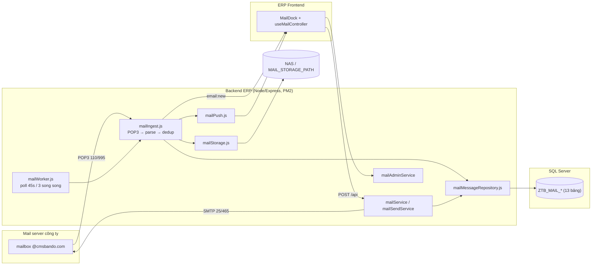
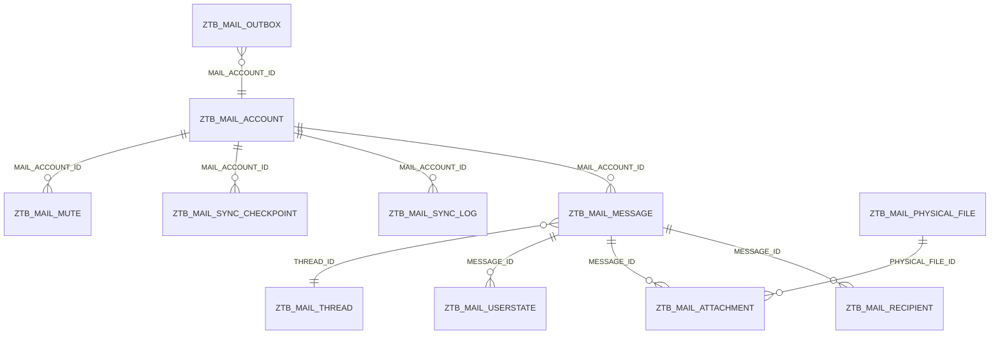

# BÁO CÁO BÀN GIAO — MODULE EMAIL TẬP TRUNG (ERP)

> Phase 9 — Migration / Pilot. Ngày: 2026-10-02.
> Phạm vi: POP3 ingestion → SQL Server + NAS → API (command `/api`) → UI React (dock hộp thư trong ERP).
> Tài liệu liên quan: `MAIL_ROLLOUT_PLAN.md` (kế hoạch triển khai), `MAIL_BACKUP_STRATEGY.md` (sao lưu/phục hồi).

---

## 1. Tổng quan & phạm vi

| Hạng mục | Nội dung |
|---|---|
| Mục tiêu | Đưa email công ty vào ERP: 1 hộp thư tập trung cho mỗi nhân viên, đọc/gửi/tìm kiếm/đính kèm ngay trong ERP, không cần mở Outlook |
| Backend | `g:\NODEJS\practice1` — Node CommonJS + Express, PM2 (fork, 1 process), HTTP 3007 / HTTPS + Socket.IO 3006 |
| Frontend | `g:\NODEJS\WEBCMS ERP2\cmsnewerp2` — Vite + React 18 + TypeScript + MUI + ag-grid |
| Lưu trữ | Body HTML + tệp đính kèm trên NAS/thư mục chia sẻ; metadata + trạng thái trong SQL Server |
| Kênh realtime | Socket.IO rooms (`email:new`, `email:state`) + Web Push (Service Worker sẵn có) |
| Ngoài phạm vi | Giao thức IMAP, đồng bộ 2 chiều xoá/đánh dấu lên server POP3, Full-Text Search (xem §9) |

---

## 2. Kiến trúc



**Luồng ingest (persist-before-emit):**
1. `mailWorker` quét các mailbox `IS_ACTIVE=1` (3 mailbox song song, mỗi lần ≤ `MAIL_MAX_BATCH_PER_RUN` email, ngân sách thời gian `MAIL_SYNC_MAX_MS`).
2. `mailPop3Client` lấy UIDL → so với `ZTB_MAIL_MESSAGE.UIDL` (đã biết) ⇒ chỉ tải email mới.
3. `mailParserService` parse MIME → subject/from/to/cc/body/preview/đính kèm.
4. Ghi body + tệp vật lý lên NAS (`sha256` + atomic write), ghi metadata vào DB trong transaction (`persistParsedEmail`).
5. Sau khi commit: phát `email:new` (Socket.IO room `user:{EMPL_NO}`) + `pushNewEmail()` (Web Push, tôn trọng mute/presence).

Sau khi commit mới phát sự kiện ⇒ client không bao giờ thấy email "ma" chưa có trong DB.

---

## 3. ERD & migration

### 3.1 Sơ đồ quan hệ



### 3.2 Danh sách bảng (13)

| # | Bảng | Vai trò |
|---|---|---|
| 1 | `ZTB_MAIL_ACCOUNT` | Mailbox: POP3/SMTP host/port/SSL/user, credential mã hoá, `IS_ACTIVE`, `LAST_SYNC_AT`, `SERVER_TOTAL` |
| 2 | `ZTB_MAIL_THREAD` | Hội thoại (`SUBJECT_NORM`, `PARTICIPANT_KEY`, `LAST_MESSAGE_AT`, `MESSAGE_COUNT`) |
| 3 | `ZTB_MAIL_MESSAGE` | Email: `MESSAGE_ID`/`UIDL`/`CONTENT_HASH` (dedup), subject, from, sent/received, preview, body inline, `BODY_PATH` (NAS), `FOLDER`, `SIZE_BYTES`, `HAS_ATTACHMENT` |
| 4 | `ZTB_MAIL_RECIPIENT` | To/Cc/Bcc chuẩn hoá (`RECIPIENT_TYPE`) |
| 5 | `ZTB_MAIL_PHYSICAL_FILE` | Kho vật lý dedup theo `FILE_HASH` + `REF_COUNT` + `STORAGE_PATH` |
| 6 | `ZTB_MAIL_ATTACHMENT` | Đính kèm theo message (`FILE_NAME`, `CONTENT_TYPE`, `CONTENT_ID`, `IS_INLINE`, `STATUS`) |
| 7 | `ZTB_MAIL_USERSTATE` | Trạng thái theo người: `IS_READ`, `IS_STARRED`, `IS_IMPORTANT`, `FOLDER_OVERRIDE`, `DELETED_AT` |
| 8 | `ZTB_MAIL_FOLDER` | Thư mục hệ thống + thư mục riêng (`FOLDER_KEY` unique theo CTR/EMPL) |
| 9 | `ZTB_MAIL_DRAFT` | Nháp soạn thư (kèm JSON người nhận + đính kèm outbox) |
| 10 | `ZTB_MAIL_OUTBOX` | Tệp soạn thảo chưa gửi (upload/delete qua `/mailfile/outbox`) |
| 11 | `ZTB_MAIL_SYNC_LOG` | Nhật ký mỗi lần đồng bộ (`STARTED_AT`, `FINISHED_AT`, `STATUS`, số lượng, lỗi) |
| 12 | `ZTB_MAIL_SYNC_CHECKPOINT` | Con trỏ UIDL cuối + lock chống chạy trùng (`LOCKED_UNTIL`) |
| 13 | `ZTB_MAIL_MUTE` | Người dùng tắt thông báo theo mailbox |

### 3.3 Index quan trọng (20)

- `UX_MAIL_ACCOUNT_EMAIL (CTR_CD, EMAIL_ADDRESS)` — chống trùng mailbox; `IX_MAIL_ACCOUNT_SYNC (IS_ACTIVE, LAST_SYNC_AT)`; `IX_MAIL_ACCOUNT_EMPL (CTR_CD, EMPL_NO, IS_ACTIVE)`.
- `UX_MAIL_MESSAGE_ID (MAIL_ACCOUNT_ID, MESSAGE_ID)` + `UX_MAIL_MESSAGE_UIDL (MAIL_ACCOUNT_ID, UIDL)` (đều **filtered** để bỏ NULL) — chống trùng ingest.
- `IX_MAIL_MESSAGE_INBOX` (mailbox + thời gian) — keyset inbox/since, `IX_MAIL_MESSAGE_THREAD`, `IX_MAIL_MESSAGE_HASH`.
- `IX_MAIL_ATTACHMENT_MSG`, `IX_MAIL_ATTACHMENT_PFILE`, `IX_MAIL_ATTACHMENT_STATUS`.
- `UX_MAIL_PHYSICAL_FILE_HASH` — dedup kho vật lý; `IX_MAIL_USERSTATE_EMPL`; `UX_MAIL_MUTE (EMPL_NO, MAIL_ACCOUNT_ID)`.
- `IX_MAIL_DRAFT_EMPL`, `IX_MAIL_OUTBOX_EMPL`, `IX_MAIL_SYNC_LOG_ACC`, `IX_MAIL_RECIPIENT_MSG`, `IX_MAIL_THREAD_LAST`, `UX_MAIL_FOLDER_KEY`.

### 3.4 Migration

- Script: `scripts/migrate_mail_tables.js` — **idempotent** (`IF OBJECT_ID(...) IS NULL` cho bảng, `IF NOT EXISTS` cho index) ⇒ chạy lại an toàn trên môi trường đã có dữ liệu.
- Chạy: `node scripts/migrate_mail_tables.js` (dùng chung pool `config/database.js`).
- Không có bảng nào của hệ thống cũ bị sửa/xoá ⇒ rollback = bỏ `MAIL_WORKER_ENABLED=true` và (nếu cần) drop các bảng `ZTB_MAIL_*`.
- Import dữ liệu ban đầu: `scripts/bulk_import_mail_accounts.js` (CSV/Excel qua giao diện admin).

---

## 4. Lưu trữ NAS

```
<MAIL_STORAGE_PATH>/
├── <CTR_CD>/<yyyy>/<mm>/<mailboxKey>/<msgRef>/body.html    # body HTML (atomic write)
└── _files/<2 ký tự đầu hash>/<sha256><ext>                 # tệp vật lý, dedup theo nội dung
```

- Root được chọn theo thứ tự: `MAIL_STORAGE_PATH` → `outbinary/mailstore` → thư mục tạm HĐH; có mount UNC qua `mailNasMount.js` (`MAIL_NAS_UNC/USER/PASS/DOMAIN/DRIVE`).
- Mọi thao tác ghi/đọc đều qua `assertInsideRoot()` ⇒ chặn path traversal; tên tệp/tên thư mục qua `safeSegment()`.
- Ghi **atomic** (`.tmp-<pid>-<random>` → `rename`) ⇒ không có file nửa vời khi tiến trình chết.
- Dedup: cùng nội dung ⇒ cùng 1 file vật lý, `REF_COUNT` tăng/giảm; `reconcile()` (chạy định kỳ `MAIL_RECONCILE_EVERY_TICKS`) đối soát DB ↔ NAS và xoá file orphan.
- Tải tệp: `GET /mailfile/attachment/:id` hỗ trợ **HTTP Range** (206) ⇒ không nạp cả file vào RAM.

---

## 5. Backend — danh mục command

Tất cả đi qua `POST /api { command, DATA }` → `services/dbCommandHandlers.js`, phong bì `{tk_status:"OK",data}` / `{tk_status:"NG",code,message}`.

**Hộp thư / đọc (`mailService.js`):** `emailBootstrap`, `emailInbox`, `emailGet`, `emailListAttachments`, `emailSearch`, `emailSync`, `emailSyncStatus`, `emailMarkRead`, `emailStar`, `emailDelete`, `emailRestore`, `emailMuteList`, `emailMuteAccount`.

**Tài khoản (`mailAccountService.js`):** `emailAccountList`, `emailAccountCreate`, `emailAccountUpdate`, `emailAccountToggle`, `emailAccountTest`, `emailAccountReset`, `emailSyncNow`, `emailSyncLogList`, `emailMyAccount`, `emailSaveMyAccount`, `emailTestMyAccount`, `emailDeleteMyAccount`.

**Gửi / nháp (`mailSendService.js`):** `emailSend`, `emailReply`, `emailReplyAll`, `emailForward`, `emailSaveDraft`, `emailDraftList`, `emailDraftGet`, `emailDeleteDraft`, `emailSendDraft`, `emailTestSmtp`.

**Quản trị (`mailAdminService.js`):** `emailAdminOverview`, `emailStorageDashboard`, `emailStorageByEmployee`, `emailReconcileNow`, `emailAccountImport`, `emailSyncAll`, `emailSyncAllStatus`.

**File:** `routes/mailFile.js` — `/mailfile/attachment/:id` (+`/inline`), `POST/DELETE /mailfile/outbox` (giới hạn `MAIL_OUTBOX_MAX_BYTES`).

**Module nội bộ:** `mailWorker` (polling), `mailIngest`, `mailPop3Client`, `mailParserService`, `mailMessageRepository`, `mailRepository`, `mailOutboxRepository`, `mailStorage`, `mailNasMount`, `mailCrypto` (AES-256-GCM), `mailHtmlSanitize`, `mailPush`, `mailReconcile`.

### 5.1 Worker & polling

| Cấu hình | Mặc định | Ghi chú |
|---|---|---|
| `MAIL_WORKER_ENABLED` | `true` | `false` để tắt worker (test/rollback) |
| `MAIL_SYNC_INTERVAL_SECONDS` | 45 | nhịp quét |
| `MAIL_MAX_CONCURRENCY` | 3 | số mailbox song song |
| `MAIL_MAX_BATCH_PER_RUN` | 500 | số email tối đa mỗi lần |
| `MAIL_SYNC_MAX_MS` | 180000 | ngân sách thời gian; hết giờ thì tự chạy tiếp lần sau (checkpoint) |
| `MAIL_SYNC_MAX_RETRIES` | 3 | số lần thử lại khi lỗi |
| `MAIL_RECONCILE_EVERY_TICKS` | 20 | chu kỳ đối soát NAS |

---

## 6. Frontend — danh mục thành phần

`src/components/Mail/`:

| File | Vai trò |
|---|---|
| `MailDock.tsx` | Cửa sổ hộp thư (desktop + mobile), deep-link `?mail=<id>`, dialog cấu hình + dialog quản trị, chỉ bật realtime khi đang mở |
| `MailSidebar.tsx` | Thư mục, danh sách mailbox + chuông mute, “Cấu hình Email của tôi” (theo `selfServiceEnabled`), “Quản trị Email” (chỉ admin) |
| `MailList.tsx` / `MailListItem.tsx` | Danh sách email, slot thanh tìm kiếm, badge chưa đọc/sao/đính kèm |
| `MailDetail.tsx` | Nội dung email, trả lời/chuyển tiếp, xoá (mềm) |
| `MailComposer.tsx` | Soạn thư: Đến/Cc/Bcc, rich editor, dán ảnh từ clipboard, dán bảng từ Excel, autosave nháp |
| `MailHtmlView.tsx` | Render HTML an toàn, rewrite `cid:` → `/mailfile/attachment/:id/inline` |
| `MailAttachmentList.tsx` | Tải bằng Blob → object URL, xem trước ảnh/PDF, cảnh báo tệp nguy hiểm |
| `MailSearchBar.tsx` | Ô tìm kiếm + sort + pill lọc nhanh + cú pháp `from:` `to:` `subject:` `body:` `filename:` `has:attachment` `is:unread|read|starred` `after:` `before:` |
| `MailSyncStatus.tsx` | Trạng thái đồng bộ (Tổng/Đã tải/Còn), nút Đồng bộ ngay, poll 4s khi đang chạy |
| `MailAccountDialog.tsx` | Form cấu hình mailbox + Test POP3/SMTP |
| `mailClipboardTable.ts` | Phát hiện bảng từ Excel, inline CSS trong `<style>`, kết xuất PNG bằng SVG `foreignObject` |
| `mailUtils.tsx` | `isMailAdminUser`, `parseMailQuery`, `isDangerousAttachment` |
| `mail.types.ts`, `mail.scss` | Kiểu dữ liệu, style (`.erp-mail__*`) |

`src/pages/setting/PrecisionEmail/` (admin):

| File | Vai trò |
|---|---|
| `PrecisionEmailAdmin.tsx` | KPI, bộ lọc, bảng mailbox (Bật/Tắt · Test · Đồng bộ ngay · Nhật ký · Reset con trỏ), dialog nhật ký, 3 thẻ dashboard dung lượng, nút Nhập từ Excel + Đồng bộ tất cả kèm dải tiến độ |
| `PrecisionEmailImportModal.tsx` | Tải tệp mẫu `.xlsx`, đọc tệp bằng `xlsx`, xem trước, “Kiểm tra trước” (DRY_RUN), bảng lỗi/cảnh báo |
| `*.scss` | Style 2 màn hình trên |

Redux: `mailSlice` (mutedAccountIds, trạng thái dock…). Route mở quản trị: `/setting/email`. Chế độ đơn nhiệm: `localStorage.erp_tab_mode='single'` khi cần mở trực tiếp bằng URL.

---

## 7. Security review

| # | Rủi ro | Kết luận hiện tại | Bằng chứng |
|---|---|---|---|
| 1 | Credential mailbox bị lộ | Mật khẩu POP3/SMTP mã hoá **AES-256-GCM** (`mailCrypto.ts`, key `MAIL_CRED_KEY`); API chỉ trả cờ `hasPassword`, không bao giờ trả mật khẩu | `test_mail_selfservice.js` — “KHÔNG lộ mật khẩu/credential” |
| 2 | HTML độc hại trong email **gửi đi** (client có thể bị bỏ qua) | **Đã thêm scrub phía server**: `sanitizeOutboundHtml()` chạy trong `emailSend` và trong nhánh trích dẫn của reply/forward, trước `embedDataImages()` — xoá `<script>/<iframe>/<object>/<embed>/<applet>/<form>/<base>/<meta>/<link>`, thuộc tính `on*`, URL `javascript:`/`vbscript:`/`livescript:`/`mocha:`, `expression(`/`behavior` trong style | case [8] của `test_mail_pilot.js` |
| 3 | XSS khi **hiển thị** email nhận | `MailHtmlView` render vào sandbox + sanitizer allowlist ở client (ảnh chỉ `cid:`/`http(s)`/`data:image`); SVG & `javascript:` bị chặn | kiểm chứng UI thật khi làm phần ảnh dán |
| 4 | IDOR nháp | `getDraft(id, { emplNo })` lọc theo `EMPL_NO`; `saveDraft`/`deleteDraft` đã scope theo chủ sở hữu | case [9] `test_mail_pilot.js` |
| 5 | IDOR đọc email/xoá | Mọi truy vấn lọc theo `MAIL_ACCOUNT_ID` thuộc quyền + `EMPL_NO`; `emailGet` với ID không thuộc quyền ⇒ `NG` | `test_mail_api.js` [7] |
| 6 | Tệp đính kèm nguy hiểm | Chỉ `image/*` (trừ SVG) + `application/pdf` được `inline`; đuôi nguy hiểm (exe/bat/cmd/ps1/vbs/js/jar/msi/scr/lnk…) ép `application/octet-stream` + `attachment` + header `X-Mail-Dangerous`; FE hiện badge cảnh báo | `test_mail_files.js` |
| 7 | Path traversal khi tải/ghi tệp | `assertInsideRoot()` + `safeSegment()`; case tên tệp chứa `..\..\` được kiểm thử | case [6] `test_mail_pilot.js` |
| 8 | Duyệt quyền admin | Quyền QUẢN TRỊ Email **chỉ dành cho `MAIL_ADMIN_EMPL_NOS`** (mặc định: **chỉ `NHU1903`**) — KHÔNG dùng chức danh/`JOB_NAME` (Leader/Admin bị từ chối). FE ẩn menu + chặn route `/setting/email` theo cùng danh sách (`mailUtils.MAIL_ADMIN_EMPL_NOS`) — chỉ là UX, BE mới là chốt | `test_mail_admin.js` [6] (gồm case `JOB_NAME=Leader` bị chặn), `test_mail_bulk.js` |
| 9 | Lạm dụng tài nguyên | Giới hạn: `MAIL_MAX_EMAIL_BYTES` 50MB, `MAIL_ATTACHMENT_MAX_BYTES` 100MB, `MAIL_SEND_MAX_ATTACH_BYTES` 50MB, `MAIL_OUTBOX_MAX_BYTES` 25MB, `MAIL_MAX_DATA_IMAGE_BYTES` 5MB, import ≤ 2000 dòng/lần, batch ≤ 500 email/lần | các test tương ứng |
| 10 | SQL injection | Toàn bộ truy vấn tham số hoá; ký tự đại diện LIKE (`%`, `_`, `[`) được escape (`likeEscape`) | `test_mail_search.js` [7] |
| 11 | Tắt self-service | `MAIL_ALLOW_SELF_SERVICE=false` ⇒ ẩn mục cấu hình cá nhân + BE chặn `emailSaveMyAccount/emailTestMyAccount/emailDeleteMyAccount` với mã `SELF_SERVICE_DISABLED` | `test_mail_bulk.js` |

### 7.1 Sự cố đã xảy ra trong quá trình kiểm thử (bài học)

- **Sự cố 1 — regex sanitizer "không khớp" nhưng thực tế vẫn chạy:** mẫu thuộc tính sự kiện ban đầu viết `/\s on[a-z]{3,}.../` (có ký tự vô hình) nên không khớp như mong đợi; đã sửa thành `/\son[a-z]{3,}\s*=\s*("[^"]*"|'[^']*'|[^\s>]+)/gi` và kiểm chứng lại: `<p onclick>` → `<p>`, `` → ``. **Bài học:** với regex an ninh, luôn kiểm chứng bằng input thật, không tin vào việc "đọc code thấy đúng".
- **Sự cố 2 — test ghi đè mailbox thật (mất mật khẩu):** kịch bản test self-service ban đầu chạy bằng EMPL_NO thật `NHU1903`; `emailSaveMyAccount` upsert theo `EMPL_NO` nên **đã ghi đè cấu hình + mật khẩu** của mailbox thật `nvh1903@cmsbando.com` (host → `127.0.0.1:2`, `IS_ACTIVE=0`). Đã khôi phục phần cấu hình (email, POP3 `mail.cmsbando.com:110` non-SSL, SMTP `mail.cmsbando.com:25` non-SSL, active) nhưng **mật khẩu không thể khôi phục** — người dùng phải nhập lại trong “Cấu hình Email của tôi”.
  **Bài học (đã áp dụng):** mọi test/script không được dùng EMPL_NO thật; suite self-service nay chạy bằng EMPL giả `ZTEST-SELF` kèm cảnh báo trong file.

---

## 8. Benchmarkhiệu năng & audit execution plan

Script: `scratch/bench_mail_queries.js` — tạo 5.000 email tổng hợp vào mailbox riêng, có **warm-up** rồi đo 5 lần (min/trung vị/max), sau đó tự dọn sạch (`= 6 PASS, 0 FAIL`).

| Truy vấn | min | trung vị | Kết luận |
|---|---|---|---|
| Inbox keyset (limit 30) — `listInbox` | 16 ms | 32 ms | Đạt |
| Đếm chưa đọc — `countUnread` | 10 ms | 12 ms | Đạt |
| **Tìm kiếm LIKE theo từ khoá — `searchMessages`** | **117 ms** | **244 ms** | **Nút cổ chai duy nhất** |
| Email mới hơn mốc — `listMessagesSince` | 4 ms | 5 ms | Đạt |
| Tổng hợp dung lượng — `admin overview` | 22 ms | 29 ms | Đạt |
| Đính kèm theo message | 2 ms | 3 ms | Đạt |
| Theo hội thoại — `listThreadMessages` | 2 ms | 2 ms | Đạt |

**Audit execution plan** (`SET STATISTICS XML ON/…OFF;`):
- `listMessagesSince` → **Index Seek** trên `IX_MAIL_MESSAGE_INBOX`, không scan.
- `listInbox` / `countUnread` → dùng `PK_MAIL_USERSTATE` + `IX_MAIL_MESSAGE_INBOX` (Index Seek + Scan có chủ đích cho phần lọc).
- `listAttachmentsByMessage` → seek bằng `IX_MAIL_ATTACHMENT_MSG`.
- `listThreadMessages` → seek bằng `IX_MAIL_MESSAGE_THREAD`.
- `searchMessages` → **Clustered Index Scan** ~105 ms (không thể seek vì LIKE có ký tự đại diện ở đầu `%kw%`).

**Kết luận hiệu năng:** mọi truy vấn khác đều dưới 35 ms ở mốc 5.000 email; chỉ tìm kiếm LIKE là vấn đề và tăng tuyến tính theo số dòng (dự kiến ≈ 2–5 s ở mốc 100k). Thời gian thực đo trên máy dev có dao động (cùng script cho trung vị 159 ms–244 ms tuỳ lần chạy) nên báo cáo dùng **trung vị** làm chỉ số chính.

**Biện pháp khuyến nghị (chưa bật):** tạo SQL Server **Full-Text Index** trên `SUBJECT`, `PREVIEW_TEXT`, `BODY_INLINE`, `FROM_ADDRESS`, `FROM_NAME` và chuyển `searchMessages` sang `CONTAINS` khi có index. Việc này cần quyền `CREATE FULLTEXT CATALOG` trên SQL Server ⇒ **cần thực hiện ở bước nâng cấp, không thuộc phạm vi bản bàn giao này**.

---

## 9. Hạn chế đã biết

1. **Tìm kiếm LIKE** = clustered index scan (xem §8) — dùng tốt tới ~50k email toàn hệ thống; vượt ngưỡng cần Full-Text.
2. **Không tìm trong body lưu NAS**: nội dung chỉ được tìm trong `BODY_INLINE`/`PREVIEW_TEXT` (body lớn hơn `MAIL_BODY_INLINE_MAX_BYTES` nằm trên NAS không tham gia tìm kiếm).
3. **POP3 là một chiều**: xoá/đánh dấu trong ERP **không** đẩy ngược lên mail server; xoá là xoá mềm theo từng người (`ZTB_MAIL_USERSTATE.DELETED_AT`), dữ liệu gốc còn nguyên.
4. **Một mailbox không dùng chung cho nhiều người**: `ZTB_MAIL_ACCOUNT` gắn với `EMPL_NO`; không có mô hình hộp thư nhóm.
5. **Retention/archive hiện là COPY-only** — chưa tự động xoá dữ liệu gốc (xem `MAIL_BACKUP_STRATEGY.md`).
6. **Mật khẩu mailbox thật `nvh1903@cmsbando.com`** đã bị ghi đè bởi test (xem §7.1) — cần nhập lại thủ công.

---

## 10. Cấu hình môi trường (đầy đủ)

| Biến | Mặc định | Ý nghĩa |
|---|---|---|
| `MAIL_STORAGE_PATH` | `outbinary/mailstore` | Kho body + tệp đính kèm |
| `MAIL_CRED_KEY` | — (**bắt buộc**) | Khoá AES-256-GCM cho credential |
| `MAIL_WORKER_ENABLED` | `true` | Bật/tắt worker ingest |
| `MAIL_SYNC_INTERVAL_SECONDS` / `MAIL_MAX_CONCURRENCY` / `MAIL_MAX_BATCH_PER_RUN` / `MAIL_SYNC_MAX_MS` / `MAIL_SYNC_MAX_RETRIES` | 45 / 3 / 500 / 180000 / 3 | Nhịp và giới hạn ingest |
| `MAIL_RECONCILE_EVERY_TICKS` | 20 | Chu kỳ đối soát NAS |
| `MAIL_POP3_TIMEOUT_MS` / `MAIL_SMTP_TIMEOUT_MS` | 30000 | Timeout |
| `MAIL_MAX_EMAIL_BYTES` / `MAIL_ATTACHMENT_MAX_BYTES` / `MAIL_SEND_MAX_ATTACH_BYTES` / `MAIL_OUTBOX_MAX_BYTES` / `MAIL_MAX_DATA_IMAGE_BYTES` | 50MB / 100MB / 50MB / 25MB / 5MB | Giới hạn an toàn |
| `MAIL_BODY_INLINE_MAX_BYTES` | 262144 | Ngưỡng body lưu DB vs NAS |
| `MAIL_TLS_REJECT_UNAUTHORIZED` | `true` | Đặt `false` cho mail server tự ký |
| `MAIL_SMTP_HOST/PORT/SECURE` | — | Mặc định SMTP khi mailbox không khai báo |
| `MAIL_DEFAULT_POP3_HOST/PORT/SECURE` | — | Mặc định khi import Excel thiếu cột |
| `MAIL_NAS_UNC/USER/PASS/DOMAIN/DRIVE` | — | Mount kho chia sẻ |
| `MAIL_ALLOW_SELF_SERVICE` | `true` | `false` ⇒ chỉ admin cấu hình mailbox |
| `MAIL_ADMIN_EMPL_NOS` | `NHU1903` | Danh sách EMPL_NO được QUẢN TRỊ Email (không có `JOB_NAME` nào được quyền) |

> Env được nạp từ `outbinary/.ENV` rồi `.ENV` ở thư mục gốc. **Không** ghi mật khẩu vào log.

---

## 11. Kết quả kiểm thử & tiêu chí nghiệm thu

### 11.1 Regression tổng — **322 PASS / 0 FAIL** (12 suite, chạy trên hệ thống thật + mailbox thật)

| Suite | Kết quả | Phạm vi |
|---|---|---|
| `test_mail_ingest.js` | 31/31 | Ingest, dedup UIDL/Message-ID/hash, checkpoint |
| `test_mail_api.js` | 22/22 | Bootstrap, inbox, get, markRead (đo giảm unread theo trạng thái chuẩn hoá), star, IDOR, stream tệp |
| `test_mail_selfservice.js` | 16/16 | Tự cấu hình mailbox (dùng EMPL giả), không lộ credential, chặn trùng email |
| `test_mail_dedup.js` | 11/11 | Chống trùng, lock, `SERVER_TOTAL` |
| `test_mail_send.js` | 31/31 | Gửi/trả lời/chuyển tiếp, ảnh inline `cid:`, nháp, SMTP |
| `test_mail_files.js` | 30/30 | Range, inline/attachment, tệp nguy hiểm, dedup vật lý, xem trước |
| `test_mail_search.js` | 28/28 | Từ khoá/lọc/sắp xếp/phân trang keyset/escape LIKE/cách ly công ty |
| `test_mail_realtime.js` | 20/20 | `emailSync`, khử trùng, badge, `email:state`/`email:new` đúng room |
| `test_mail_push.js` | 19/19 | Push, tag, deep-link, mute, loại thiết bị đang online |
| `test_mail_admin.js` | 33/33 | Overview, dashboard dung lượng, reconcile, nhật ký, phân quyền admin |
| `test_mail_bulk.js` | 36/36 | Import Excel (alias header, dry-run, SSL theo cổng, giới hạn dòng), Đồng bộ tất cả, cờ self-service |
| `test_mail_pilot.js` | 45/45 | 10 kịch bản pilot (xem bảng dưới) |
| `bench_mail_queries.js` | 6/6 | Benchmark + audit execution plan |

### 11.2 Ma trận pilot (bắt buộc theo Phase 9)

| # | Kịch bản | Trạng thái |
|---|---|---|
| 1 | HTML tiếng Việt + ảnh nhúng `cid:` + đính kèm thường | ✅ |
| 2 | Tiếng Hàn + subject mã hoá Base64 | ✅ |
| 3 | Thiếu `Message-ID` / không có người gửi / subject cực dài | ✅ |
| 4 | MIME hỏng (boundary không đóng) | ✅ |
| 5 | Đính kèm lớn (~2MB) | ✅ |
| 6 | Tên tệp chứa đường dẫn nguy hiểm (path traversal) | ✅ |
| 7 | Chống trùng: `Message-ID` trùng & thiếu `Message-ID` | ✅ |
| 8 | Security: lọc HTML nguy hiểm trước khi GỬI | ✅ |
| 9 | Security: nháp của người khác không đọc/xoá được (IDOR) | ✅ |
| 10 | Dọn dẹp + đối soát kho NAS | ✅ |

Các kịch bản giao thức (POP3 ngắt kết nối, timeout, SMTP fail, mất mạng giữa phiên) được kiểm tra ở tầng `test_mail_ingest.js` + `test_mail_send.js` bằng mailbox giả lập lỗi.

### 11.3 Tiêu chí nghiệm thu

| Tiêu chí | Trạng thái |
|---|---|
| Ingest được email mới từ POP3, chống trùng 3 lớp (UIDL/Message-ID/hash) | ✅ |
| Đọc/lọc/tìm kiếm/gắn sao/xoá mềm trong ERP | ✅ |
| Gửi/trả lời/chuyển tiếp, ảnh inline hiển thị đúng ở Gmail/Outlook | ✅ |
| Đính kèm: xem/tải tệp lớn (Range), chặn inline tệp nguy hiểm | ✅ |
| Realtime trong ERP (không cần F5) + Web Push + tôn trọng mute | ✅ |
| Quản trị: dashboard, nhật ký, test kết nối, reset con trỏ, đối soát NAS | ✅ |
| Nhập mailbox hàng loạt từ Excel + đồng bộ hàng loạt, có dry-run | ✅ |
| Bảo mật: mã hoá credential, sanitize 2 đầu (nhận/gửi), chống IDOR/traversal, chống SQL injection | ✅ |
| Hiệu năng: hầu hết truy vấn < 35 ms @5k email | ✅ |
| Tìm kiếm ở mốc 100k email | ⚠️ Cần Full-Text (xem §8–9) |
| Build FE `npm run build` thành công | ✅ |

---

## 12. Tài liệu kèm theo

| Tài liệu | Nội dung |
|---|---|
| `MAIL_ROLLOUT_PLAN.md` | Kế hoạch pilot → go-live, giám sát, rollback, hướng dẫn nhanh cho admin & người dùng |
| `MAIL_BACKUP_STRATEGY.md` | Sao lưu SQL + NAS, kiểm tra toàn vẹn, restore drill, RPO/RTO, retention COPY-only |
| `METADATA_MANAGEMENT_GUIDE.md`, `SMART_SYNC_LOGIC.md` | Vận hành metadata/đồng bộ của hệ thống nền |
| `scratch/test_mail_*.js`, `scratch/bench_mail_queries.js` | Bộ regression + benchmark có thể chạy lại |

---

## 13. Việc cần người dùng thực hiện ngay

> ⚠️ **Mật khẩu mailbox thật `nvh1903@cmsbando.com` đã bị test ghi đè và không thể khôi phục tự động.**
> Vào **Hộp thư → Cấu hình Email của tôi**, nhập lại mật khẩu POP3, rồi bấm **Kiểm tra kết nối**.
> Các trường khác (email, POP3 `mail.cmsbando.com:110` không SSL, SMTP `mail.cmsbando.com:25` không SSL, đang hoạt động) đã được khôi phục sẵn.
